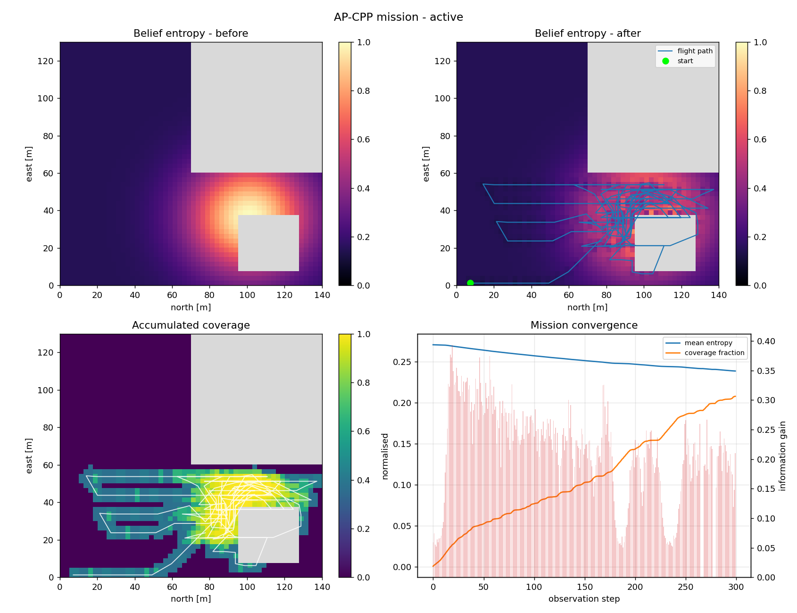
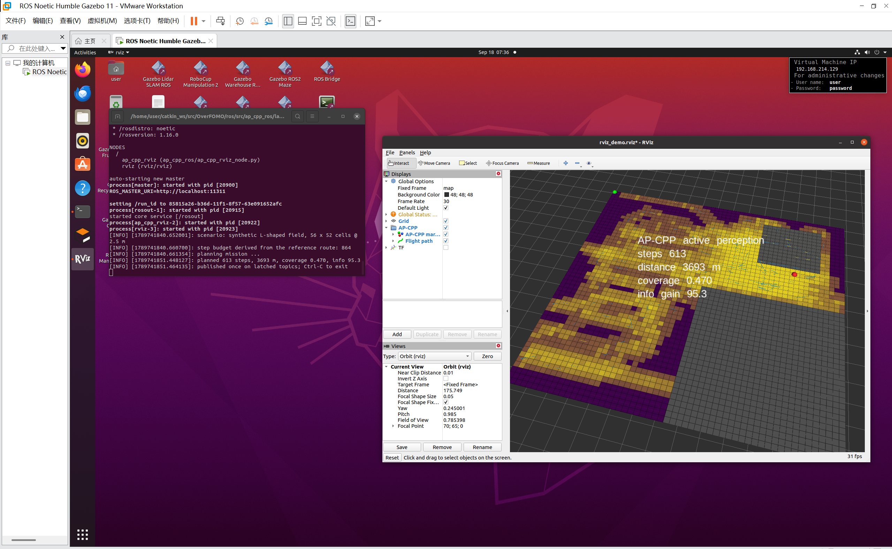
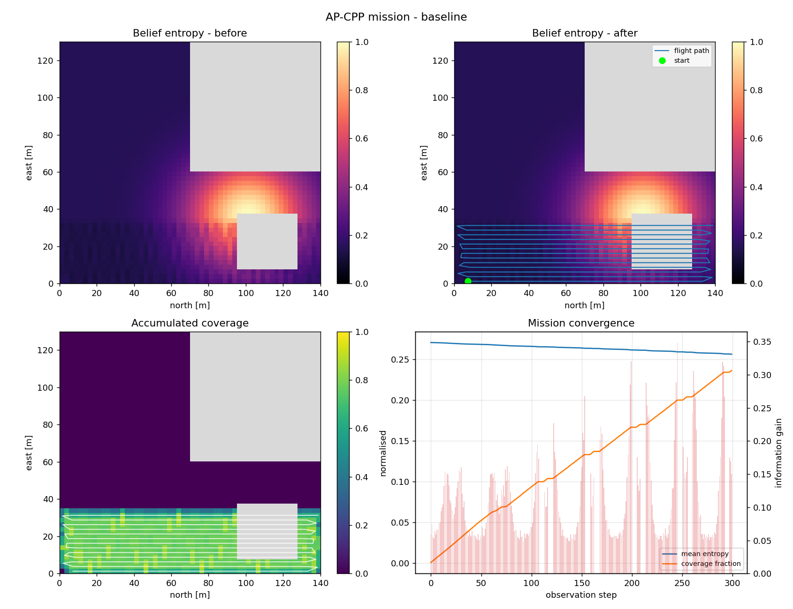
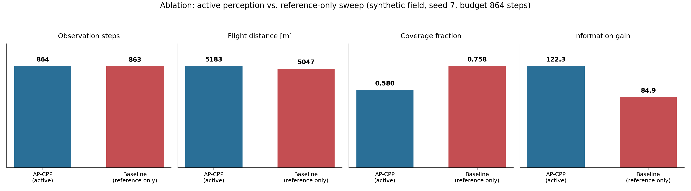

<div id="top"></div>

<div align="center">

  <a href="images/adaptive_pipeline.png">
    
  </a>

  <h1 align="center">OverFOMO &mdash; Active Perception Coverage Path Planning</h1>

  <p align="center">
    <b>AP-CPP</b>: an active-sensing extension of the OverFOMO adaptive coverage planner
    that decides <i>where to look</i>, not only <i>how fast to fly</i>.
    <br />
    <a href="#quickstart">Quickstart</a> ·
    <a href="#key-features">Features</a> ·
    <a href="#algorithm">Algorithm</a> ·
    <a href="#project-tree">Project Tree</a> ·
    <a href="#cite-as">Citation</a> ·
    <a href="https://github.com/Xiangyuetang91/OverFOMO/issues">Report Bug</a>
  </p>
</div>

---

## Overview

This repository extends the **OverFOMO** adaptive coverage path planning scheme
(Krestenitis et al., *Robotics and Autonomous Systems*, 2023) for precision
agriculture. The published method flies a pre-computed boustrophedon route
open-loop and modulates the UAV's ground speed from the semantic content of the
incoming imagery: confident, sparse detections let the vehicle speed up, dense
or ambiguous canopies make it slow down.

That controller answers *how fast should I fly over this lane*. It does not
answer *is this lane the right place to spend my battery*. **AP-CPP adds the
missing degree of freedom.**

> **A note on the numbers in this README.** The tables below are from the
> dependency-free Python demo (`demos/run_ap_cpp_demo.py`), which is what CI and
> the committed `results/` figures are generated from. The ROS node logs a
> separate set of metrics when the planner runs under `roslaunch` against the
> real ROS environment; the two are different runs and their figures are not
> interchangeable. See [Demo &amp; Visualization](#demo--visualization).

> **The gap AP-CPP closes.** A lawnmower sweep treats every square metre as
> equally interesting. Real fields are not: last season's yield map, an NDVI
> anomaly from a coarse overflight, a grower's report of a problem patch, and
> the gaps left by a previous flight all concentrate uncertainty in a handful of
> places. A robot that cannot deviate spends its endurance imaging ground it
> already understands, and returns with an unresolved map of the one region that
> mattered.

AP-CPP maintains an explicit **belief** over the operational area &mdash;
occupancy plus per-cell information entropy &mdash; and re-plans the remainder of
the route over a **receding horizon**, scoring every candidate with a utility
that trades tour cost against expected information gain.

The result is a planner that is *safe by construction*: on a field where nothing
in particular is known, a lateral-deviation term pins it to the published sweep,
so it degrades exactly to the baseline behaviour. It only leaves the corridor
when a genuine information hotspot outbids the detour.

<br />

<div align="center">
  
  <br />
  <em>Belief entropy before/after, accumulated coverage, and mission convergence.</em>
</div>

---

## Demo &amp; Visualization

### Live in RViz

The planner runs headlessly against the field definition in this repository and
publishes `Path` + `MarkerArray` for RViz &mdash; no AirSim, no Unreal, no
simulator connection. The screenshot below is from an actual run on the ROS box.

<div align="center">
  <a href="docs/rviz_demo.svg">
    
  </a>
  <br />
  <em>AP-CPP under <code>roslaunch ap_cpp_ros rviz_demo.launch</code> on
  <b>Ubuntu 22.04 (VMware virtual machine) + ROS Noetic</b>
  (<code>rosversion 1.16.0</code>), project checkout at
  <code>/home/user/catkin_ws/src/OverFOMO</code>. The coverage route is drawn as a
  <code>nav_msgs/Path</code>, the belief grid and information hotspots as a
  <code>visualization_msgs/MarkerArray</code>; the field geometry is the
  repository's own <code>CPP/002</code> definition.
  <br />
  <sub>Click the image for the vector version (<code>docs/rviz_demo.svg</code>) &mdash;
  scalable, but traced from a raster screenshot, so the small terminal text is
  sharper in the PNG above.</sub></em>
</div>

```sh
roslaunch ap_cpp_ros rviz_demo.launch                          # AP-CPP
roslaunch ap_cpp_ros rviz_demo.launch reference_only:=true     # ablation
roslaunch ap_cpp_ros rviz_demo.launch source:=geojson field:=002
```

#### What this demo validates

The scope here is the **AP-CPP core algorithm** &mdash; not a full simulator
fly-through. The run above is the evidence for the planner itself, and it
covers all three things that matter for the algorithm:

| Evidence | Published as | Seen in |
|---|---|---|
| **Global coverage trajectory** &mdash; the receding-horizon route over the field, with its excursions and rejoins | `nav_msgs/Path` | RViz screenshot above; four-panel figures below |
| **Information-hotspot belief grid** &mdash; per-cell entropy, computed before and after the mission | `visualization_msgs/MarkerArray` | RViz screenshot; `Belief entropy` panels |
| **Ablation vs. baseline** &mdash; active perception against the reference-only sweep, on identical field and prior | second arm of the same launch (`reference_only:=true`) | `Ablation` and `Trajectory comparison` figures under Quickstart &sect;2 |

No Gazebo scene, no Unreal render and no AirSim flight imagery is required to
reproduce any of it: the planner is simulator-independent by construction and
the figures regenerate from the committed code.

### Simulator-free mission diagnostics

Running `python demos/run_ap_cpp_demo.py --compare` writes a four-panel
diagnostic figure per arm: belief entropy before/after, accumulated coverage,
the planned route over the field, and mission convergence.

<div align="center">
  <table>
    <tr>
      <th align="center">AP-CPP (active perception)</th>
      <th align="center">Reference-only baseline</th>
    </tr>
    <tr>
      <td align="center"></td>
      <td align="center"></td>
    </tr>
    <tr>
      <td align="center"><em>Leaves the corridor to resolve the anomaly hotspot,<br />then rejoins the reference sweep.</em></td>
      <td align="center"><em>Pinned to the published boustrophedon sweep;<br />never deviates.</em></td>
    </tr>
  </table>
</div>

---

## Key Features

| Feature | Description |
|---|---|
| **Information-entropy belief grid** | Per-cell Shannon entropy over semantic classes, fused Bayesian-style from every observation. `ap_cpp/grid_model.py` |
| **Exact forward model** | The planner scores candidate views by replaying the *same* fusion kernel the runtime uses &mdash; no surrogate, no train/serve skew. Covered by `test_prediction_matches_the_realised_update`. |
| **Composite utility** | Information gain + frontier density − travel − heading change − revisit − corridor deviation, geometrically discounted over the horizon. `ap_cpp/utility.py` |
| **Rolling-horizon planning** | Receding-horizon (MPC-style) replanning: commit a short prefix, re-optimise from the pose actually reached. Robust to wind, controller lag and misdetections by construction. |
| **Mixed candidate set** | Reference sweep, entropy-biased A\* excursions that *rejoin* the route, an angular fan, and coverage repair &mdash; all normalised to a common horizon length before comparison. |
| **Sensor-aware footprints** | Oriented ground rectangle with cosine off-nadir efficiency falloff, matching the RedEdge-M payload in `main.py`. Swath/along-track axes are handled explicitly (`test_swath_is_the_cross_track_extent`). |
| **Baseline speed law preserved** | The published `G(confidence, coverage_ratio)` controller is reused bit-for-bit and extended with a bounded active-perception term. `ap_cpp/control.py` |
| **Two perception back-ends** | A dependency-free `DemoPerceptionModel` for CI/demos, and a `SegmentationPerceptionModel` adapter for the real U-Net + GDAL orthomosaic path. |
| **Zero-hardware demo** | Full mission with diagnostics and figures using only NumPy + matplotlib. No AirSim, no TensorFlow, no GDAL. |
| **AirSim integration** | `ap_cpp/airsim_driver.py` drops into the existing `parameters.py` configuration unchanged. |

---

## Quickstart

### 1. Requirements

The **core planner and demo need only NumPy** (matplotlib optional, for figures):

```sh
python -m pip install numpy matplotlib
```

The **simulation pipeline** (AirSim + segmentation + orthomosaic) additionally
needs the full stack from `requirements.txt`, including GDAL and TensorFlow:

```sh
python -m pip install -r requirements.txt
```

> GDAL is not on PyPI as a source distribution. Install a pre-built wheel
> matching your Python version from
> [here](https://www.lfd.uci.edu/~gohlke/pythonlibs/#gdal), then
> `python -m pip install path-to-wheel-file.whl`. Anaconda users should install
> `gdal` through conda instead.

### 2. Run the demo (one command, no simulator)

```sh
python demos/run_ap_cpp_demo.py --compare
```

This runs a complete active-perception coverage mission on a synthetic
L-shaped field with a no-fly zone, prints per-step diagnostics, runs the
reference-only ablation alongside it, and writes a JSON report plus four-panel
diagnostic figures to `results/ap_cpp_demo/`.

```
=== AP-CPP (active perception) ===
  termination            : max_steps
  observation steps      : 864
  flight distance        : 5183.1 m
  mean belief entropy    : 0.2084 (was 1.0000)
  coverage fraction      : 0.5805
  cumulative information : 122.327

=== Active perception vs reference-only ablation ===
metric                           active    reference      delta
------------------------------------------------------------------
flight distance [m]              5183.1       5047.4       +135.7
mean entropy                     0.2084       0.2273      -0.0190
coverage fraction                0.5805       0.7580      -0.1776
information gain                122.327       84.935      +37.392
```

The honest reading of those numbers: **AP-CPP gathers 44% more information**
(+37.4 nats) and resolves the belief further (mean entropy 0.2084 vs 0.2273), at
the cost of **0.178 of coverage** &mdash; it finishes the reference route having
covered 58% of the field where the plain sweep reaches 76%. Per metre flown the
information advantage is +40%. The two arms fly essentially the same mission
(864 vs 863 observation steps, 5183 m vs 5047 m over the identical reference
route), so this is a like-for-like trade rather than one arm simply flying
longer.

That trade is what the user is buying, and the coverage cost is real: if
throughput matters more than map quality, raise the `frontier`/`information`
weights, or run a longer mission. On an *uninformative* prior the two
configurations are identical by design &mdash; see
`test_active_mode_does_not_degrade_a_uniform_prior_mission`.

> These figures are reproducible from the committed code: the step budget
> derives from the reference route itself, and the reference-only arm runs with
> `enable_coverage_repair` off (see `coverage_repair` under **The pieces**), so
> neither arm can fly past the end of the route and bank coverage the other one
> never gets a chance at.

#### Ablation

<div align="center">
  
  <br />
  <em>Active perception vs. the reference-only sweep on the synthetic field
  (seed 7, 864-step budget). The two arms fly a near-identical mission
  &mdash; 864 vs 863 observation steps, 5183 m vs 5047 m &mdash; so the
  +44% information gain is bought by <b>where</b> the vehicle looks, not by
  flying further. Coverage is the price paid: 0.580 vs 0.758.</em>
</div>

#### Trajectory comparison

The pair below is the same ablation flown against the repository's own field
`CPP/002` (`--source geojson`). Both arms see the identical anomaly prior; only
AP-CPP is free to leave the corridor. The divergence is visible in the
entropy-after panels: the baseline sweeps the polygon in parallel lanes and
leaves the hotspot half-resolved, while AP-CPP cuts diagonal traverses into it
before rejoining the route.

<div align="center">
  <table>
    <tr>
      <th align="center">AP-CPP (active perception)</th>
      <th align="center">Reference-only baseline</th>
    </tr>
    <tr>
      <td align="center"></td>
      <td align="center"></td>
    </tr>
    <tr>
      <td align="center"><em>Deviates into the hotspot, then rejoins.<br />info gain 10.99, coverage 0.561</em></td>
      <td align="center"><em>Parallel lanes, corridor-pinned.<br />info gain 9.52, coverage 0.744</em></td>
    </tr>
  </table>
</div>

### 3. Run against the real field shipped in this repo

Uses `CPP/002/Polygon002.geojson` and the pre-baked `TurnWPs.txt` route,
converted through the same WGS84→NED path as the flight code:

```sh
python demos/run_ap_cpp_demo.py --source geojson --field 002 --compare
```

```
=== Active perception vs reference-only ablation ===
metric                           active    reference      delta
------------------------------------------------------------------
flight distance [m]               572.7        562.2        +10.5
duration [s]                      217.9        221.8         -4.0
observation steps                   100           99           +1
mean entropy                     0.2143       0.2203      -0.0060
coverage fraction                0.5605       0.7445      -0.1839
information gain                 10.987        9.518       +1.469
```

The same qualitative trade shows up on the real field &mdash; more information
(+15%), less coverage (−0.184). The information margin is much smaller here than
on the synthetic field because field 002's route is short (591.6 m, 99
observation steps), so neither arm has much room to diverge before the route
runs out. Reports and figures land in `results/ap_cpp_demo_geojson/`.

### 4. Run the test suite

```sh
python -m unittest discover -s tests -v
```

43 tests covering rasterisation, belief fusion, sensor geometry, the utility's
forward model, A\* and route resampling, speed-law conformance, mission
invariants and the WGS84 round trip. No simulator or TensorFlow required.

### 5. Useful demo flags

```sh
--source {synthetic,geojson}   # field geometry source
--prior {none,anomaly,two_zones}
                               # non-uniform uncertainty prior to explore
--prior-weight FLOAT           # prior blend, default 0.85
--horizon INT                  # rolling-horizon length, default 6
--execute-steps INT            # poses committed before replanning, default 2
--step-length FLOAT            # observation spacing, m, default 6.0
--entropy-bias FLOAT           # uncertainty discount in A* edge cost
--coverage-target / --entropy-target
--max-steps INT                # step budget; default = one pass over the route
--max-time FLOAT               # wall-clock budget; default derived so steps bind first
--no-plots                     # skip figure generation
--compare                      # run the reference-only ablation
```

> Both arms of an ablation must fly the *same* mission, so the default budgets
> derive from the reference route rather than a fixed constant. The shipped
> `TurnWPs.txt` routes are far shorter than the fields they cover: a fixed
> 400-step budget would let both arms fly hundreds of steps past the end of the
> route, and the reference-only arm would bank coverage the published sweep
> never performs.

### 6. Fly it in AirSim

```sh
python -m ap_cpp.airsim_driver              # live flight
python -m ap_cpp.airsim_driver --dry-run    # validate config without Unreal
```

`--dry-run` exercises the full belief loop against the real orthomosaic without
connecting to the simulator &mdash; the fastest way to check that a field's
configuration is sane before launching Unreal.

### 7. Visualise it in RViz (ROS 1, no AirSim)

`ros/` is a standard catkin workspace containing one package, `ap_cpp_ros`. The
node runs the planner **headlessly** against the same field definitions the
demo uses and publishes the result for RViz, so this path needs neither AirSim,
Unreal, nor the TensorFlow/GDAL stack &mdash; only a sourced ROS 1 environment
and NumPy.

The configuration used for the screenshot above is **Ubuntu 22.04 running in a
VMware virtual machine, with ROS Noetic (`rosversion 1.16.0`)**, and the
repository checked out at `/home/user/catkin_ws/src/OverFOMO`:

```sh
sudo apt install ros-noetic-desktop-full python3-numpy
source /opt/ros/noetic/setup.bash

# In the repository:
cd ros
catkin_make
source devel/setup.bash
```

Then launch the demo &mdash; the planner runs, publishes once on latched topics,
and RViz opens on the result:

```sh
roslaunch ap_cpp_ros rviz_demo.launch
roslaunch ap_cpp_ros rviz_demo.launch source:=geojson field:=002
roslaunch ap_cpp_ros rviz_demo.launch reference_only:=true   # the ablation arm
```

Or run the node directly and start RViz yourself:

```sh
rosrun ap_cpp_ros ap_cpp_rviz_node.py --source geojson --field 002
rviz -d $(rospack find ap_cpp_ros)/config/rviz_demo.rviz
```

What you get:

| Topic | Type | Contents |
|---|---|---|
| `/ap_cpp_rviz/path` | `nav_msgs/Path` | the flown observation path |
| `/ap_cpp_rviz/markers` | `visualization_msgs/MarkerArray` | coverage raster, obstacles, reference sweep, endpoints, summary label |

The node plans in NED metres and publishes ENU for RViz
(`ros.x = ned.y`, `ros.y = ned.x`, `ros.z = −ned.z`), which puts the field in
the `z = +altitude` plane with north along `+y`. Pass `--no-frame-swap` to
publish raw NED. `--decimate N` thins the raster markers if RViz struggles on a
large field.

> **Moving the repo into the VM.** The ROS machine only needs the repository
> itself &mdash; `ap_cpp/`, `CPP/` and `ros/`. Either clone it inside the VM or
> share the host folder and run `catkin_make` from the shared copy. Nothing in
> this path imports `airsim`, so the AirSim install is not required.

---

## Algorithm

### Data flow

```
                      ┌───────────────────────────────────────────┐
   parameters.py ───▶ │  GeoBridge                                │
   *.geojson     ───▶ │  WGS84 ──▶ NED (handleGeo.ConvCoords)     │──▶ CoverageGrid
   TurnWPs.txt   ───▶ │  rasterise polygon + obstacles            │    (occupancy,
                      └───────────────────────────────────────────┘     entropy, coverage)
                                        │
                                        ▼
   ┌────────────────────────────────────────────────────────────────────────┐
   │  RollingHorizonPlanner.plan(pose)             ◀── receding horizon     │
   │                                                                        │
   │   candidate generators                    UtilityModel.evaluate_path   │
   │   ┌──────────────────────┐                ┌──────────────────────────┐ │
   │   │ reference_sweep      │                │ + w_i · IG(pose)         │ │
   │   │ frontier_astar_{k}   │─── scored ───▶ │ + w_f · frontier(pose)   │ │
   │   │ fan_{±θ}             │   against      │ − w_d · travel           │ │
   │   │ coverage_repair      │   the belief   │ − w_t · |Δyaw|           │ │
   │   └──────────────────────┘                │ − w_r · revisit          │ │
   │            ▲                              │ − w_c · corridor deviation│ │
   │            │                              └──────────────────────────┘ │
   │            │  entropy-biased A*, 8-connected, corner-cut-safe          │
   │            └───────────────────────────────────────────────────────────│
   │                                                                        │
   │   commit first `execute_steps` poses  ──▶  next replanning epoch       │
   └────────────────────────────────────────────────────────────────────────┘
                                        │
                                        ▼
   ┌────────────────────────────────────────────────────────────────────────┐
   │  SensorModel.observe(pose, measurement_entropy)                        │
   │  Bayesian multiplicative fusion:  H ← H · (1 − w · η · (1 − h_meas))   │
   │  Coverage accum.:                 C ← C + η · g · (1 − C)              │
   └────────────────────────────────────────────────────────────────────────┘
                                        │
                    ┌───────────────────┴───────────────────┐
                    ▼                                       ▼
        APCPPSpeedController                     Updated belief ──▶ next epoch
        baseline G(conf, cr) + active term
```

### The pieces

**1. Belief grid** (`ap_cpp/grid_model.py`)

A raster in the local NED frame already used by `handleGeo`. Each traversable
cell carries:

- `entropy ∈ [0, 1]` — normalised Shannon entropy of the semantic belief.
  `1.0` is "we know nothing", `0.0` is "the segmentation model is certain".
  This is the spatially-resolved generalisation of the published method's
  scalar *confidence level*.
- `coverage ∈ [0, 1]` — accumulated observation quality. `1.0` means imaged
  often enough, at a high enough ground sampling distance, to call it done.
  Generalises the scalar *coverage ratio*.

Non-traversable cells are sentinel-set (`entropy = 0`, `coverage = 1`) so they
never attract information-driven motion while remaining valid for path search.

**2. Fusion** — planned and realised updates are the *same code path*:

```
H_posterior = H_prior · (1 − w · η · (1 − h_meas))
```

where `w` is the in-frame weight, `η` the observation efficiency and `h_meas`
the frame entropy reported by the network. A perfect measurement of a
deterministic cell (`h_meas → 0`) collapses the belief; an uninformative one
(`h_meas → 1`) leaves it untouched. Because
`SensorModel.predict_update` calls `CoverageGrid.fuse` rather than reimplementing
it, the planner optimises the true objective, and a regression test pins that
equivalence.

**3. Sensor model** (`ap_cpp/sensor.py`)

The footprint is the oriented ground rectangle of a nadir camera. The
**swath** (cross-track extent) is computed from the 46° HFOV and is what sets
the lane spacing; the **along-track** extent is the 35° VFOV and sets the
observation cadence. Efficiency falls off as `1/sqrt(1 + t²)` with the
normalised off-nadir coordinate `t`, which is why *where* the robot looks
matters and not only *whether* it looked.

**4. Utility** (`ap_cpp/utility.py`)

```
U(π) = Σ_k γ^k [ w_i·IG(pose_k) + w_f·Φ(pose_k)
               − w_d·d(pose_{k−1}, pose_k)/L
               − w_t·|Δyaw|/180
               − w_r·mean C(pose_k)
               − w_c·dev(pose_k, corridor)/L ]
```

The belief is rolled forward on a scratch copy, so a candidate that re-observes
ground already covered by an earlier step of *its own* plan correctly earns no
second information gain.

**5. Rolling horizon** (`ap_cpp/planner.py`)

Candidate generators, each normalised to a common horizon length before
scoring &mdash; a candidate that stops early would otherwise bank no travel cost
for the leg it never flies and win by being lazy:

- `reference_sweep` — the published route, resampled by **arc length** at exact
  `step_length`. (Snapping to route *vertices* instead livelocks whenever the
  route is sampled more coarsely than `step_length` &mdash; which the shipped
  `TurnWPs.txt` files are. The projection is onto the nearest segment, not the
  nearest vertex.)
- `frontier_astar_{k}` — entropy-biased A\* out to a ranked uncertainty
  frontier, then a plain A\* leg back onto the route. The excursion is a single
  connected path so the travel penalty charges the full round trip; a detour
  that does not rejoin is a coverage hole, not a plan. Frontier ranking uses a
  summed-area integral image of uncertain density, so a lone stray cell cannot
  outrank a genuinely unobserved region.
- `fan_{±θ}` — straight marches on an angular fan, for the common case where a
  small heading tweak beats a detour.
- `coverage_repair` — shortest path to the most overdue cell by
  `(1 − C) / distance`. Gated behind `enable_coverage_repair`, which the demo
  binds to the `active` flag. The holes this generator patches are the ones
  active perception *created* by leaving the corridor, so a reference-only
  baseline must not be handed it: with the gate open the baseline keeps flying
  after its route is spent and banks coverage the published sweep never
  performs, silently turning the ablation into a comparison of two different
  missions. A genuine reference-only run holds station when its route runs out.

Only the first `execute_steps` poses are committed. The next replan starts from
**the pose actually reached**, which is where wind, controller lag and model
error enter the loop and get corrected.

**6. Speed** (`ap_cpp/control.py`)

The published law is preserved exactly:

```
v = v_nominal + (1 − 2·cr_norm) · Q_max
```

AP-CPP adds a bounded active-perception term so the vehicle also slows where the
*map* is unresolved, even if the current frame happens to look confident:

```
v = clip(v_nominal + (1 − 2·cr_norm)·Q_max − Q_max·(tanh(IG/IG₀) + ρ·H̄))
```

---

## Project Tree

```
OverFOMO/
├── ap_cpp/                      # ← Active Perception Coverage Path Planning
│   ├── __init__.py              # Public API surface
│   ├── grid_model.py            # Belief raster: occupancy, entropy, coverage, fusion
│   ├── pose.py                  # Pose primitives, heading / angle helpers
│   ├── sensor.py                # Camera footprint, efficiency falloff, forward model
│   ├── utility.py               # Composite objective, path evaluation, G(x,y) bridge
│   ├── planner.py               # Rolling-horizon planner, A*, candidate generators
│   ├── control.py               # Baseline speed law + active-perception term
│   ├── runtime.py               # Perception back-ends (demo + U-Net adapter)
│   ├── mission.py               # Mission driver and flight log
│   ├── geo_bridge.py            # WGS84 ⇄ NED mission I/O, grid construction
│   └── airsim_driver.py         # AirSim integration (drop-in for main.py)
│
├── demos/
│   └── run_ap_cpp_demo.py       # One-command runnable demo + ablation + figures
│
├── ros/                         # catkin workspace: RViz visualisation, no AirSim
│   └── src/ap_cpp_ros/
│       ├── package.xml
│       ├── CMakeLists.txt
│       ├── scripts/ap_cpp_rviz_node.py   # publishes Path + MarkerArray
│       ├── launch/rviz_demo.launch       # standalone, no simulator
│       └── config/rviz_demo.rviz
│
├── tests/
│   └── test_ap_cpp.py           # 43 regression tests, NumPy-only
│
├── handleGeo/                   # WGS84 / NED / ECEF conversions (upstream)
│   ├── ConvCoords.py            #   coordinate frame conversions
│   ├── InPolygon.py             #   vectorised point-in-polygon
│   ├── NodesInPoly.py           #   BCD node generation (upstream)
│   ├── Dist.py
│   └── coordinates/
│       ├── WGS84.py
│       ├── NED.py
│       └── ECEF.py
│
├── CPP/                         # Per-field mission data
│   └── 002/
│       ├── Polygon002.geojson   #   operational polygon (QGIS export)
│       ├── TurnWPs.txt          #   pre-computed boustrophedon route (WGS84)
│       └── viewpoints_map.jpg
│
├── main.py                      # Original OverFOMO AirSim mission (upstream)
├── get_new_speed.py             # U-Net speed inference (upstream)
├── keras_tools.py, speed_function.py, check_g_func.py   # upstream analysis
├── parameters.py                # Mission configuration (paths, payload, speeds)
├── inputVariables.json          # Polygon/obstacle spec when QGIS=False
├── requirements.txt             # Full simulation-pipeline dependencies
├── results/                     # Mission outputs (generated)
├── images/, gif/                # Documentation assets
└── weights0500.hdf5             # Trained segmentation weights
```

---

## Configuration

All mission parameters live in `parameters.py`, exactly as for the original
pipeline. AP-CPP adds its own tunables through dataclasses, all of which have
sane defaults:

| Dataclass | Module | Purpose |
|---|---|---|
| `GridConfig` | `grid_model.py` | Raster resolution and extent |
| `SensorConfig` | `sensor.py` | FOV, altitude, efficiency falloff |
| `UtilityWeights` | `utility.py` | Objective term weighting |
| `PlannerConfig` | `planner.py` | Horizon, cadence, A\* knobs |
| `MissionConfig` | `mission.py` | Termination criteria |

Two knobs matter most in practice:

- **`UtilityWeights.corridor`** (default `1.15`) — how strongly to hold the
  published route. Raise it for conservative operations, lower it to let the
  planner chase information harder.
- **`UtilityWeights.information`** (default `1.0`) — the value of a unit of
  uncertainty resolved, relative to a metre of flight.

---

## Controlling a Real Field: an Agronomic Prior

The planner is most useful when seeded with an uncertainty prior, because a
robot with no prior knowledge has nothing to be curious *about*. Use
`CoverageGrid.set_uncertainty_prior`:

```python
from ap_cpp.grid_model import CoverageGrid
from ap_cpp.geo_bridge import GeoBridge, load_qgis_polygon

polygon, obstacles, _ = load_qgis_polygon("CPP/002/Polygon002.geojson")
grid = GeoBridge(polygon, obstacles).build_grid(resolution=2.5)

# Any [0, 1] risk layer at the raster's shape: last season's yield map, an
# NDVI anomaly, a scout's report, gaps from the previous flight.
grid.set_uncertainty_prior(ndvi_anomaly_normalised, weight=0.85)
```

Then hand the grid to a mission exactly as the demo does.

---

## Contributing

Contributions are welcome. The workflow is standard:

1. Fork the project
2. Create a feature branch (`git checkout -b feature/AmazingFeature`)
3. Run the suite before pushing (`python -m unittest discover -s tests`)
4. Commit using [Conventional Commits](https://www.conventionalcommits.org/)
   (`feat(planner): ...`, `fix(sensor): ...`, `docs: ...`)
5. Open a pull request

Please keep `ap_cpp/` free of simulator and TensorFlow imports at module scope
&mdash; the demo and the test suite must keep running on a bare NumPy install.

---

## License

Distributed under the MIT License. See [LICENSE](LICENSE) for more information.

---

## Cite As

If you use the AP-CPP module, please cite the underlying OverFOMO work it
extends:

*M. Krestenitis, E. K. Raptis, A. C. Kapoutsis, K. Ioannidis, E. B. Kosmatopoulos,
and S. Vrochidis, "Overcome the fear of missing out: Active sensing UAV scanning
for precision agriculture," Robotics and Autonomous Systems, p. 104581, 2023.*
[[Link]](https://www.sciencedirect.com/science/article/pii/S0921889023002208)

```bibtex
@article{krestenitis2023overcome,
  title={Overcome the fear of missing out: Active sensing UAV scanning for precision agriculture},
  author={Krestenitis, Marios and Raptis, Emmanuel K and Kapoutsis, Athanasios Ch and Ioannidis, Konstantinos and Kosmatopoulos, Elias B and Vrochidis, Stefanos},
  journal={Robotics and Autonomous Systems},
  pages={104581},
  year={2023},
  publisher={Elsevier}
}
```

---

## Acknowledgments

This research has been financed by the European Regional Development Fund of the
European Union and Greek national funds through the Operational Program
Competitiveness, Entrepreneurship and Innovation, under the call RESEARCH –
CREATE – INNOVATE (T1EDK-00636).

The AP-CPP extension builds on the upstream
[Adaptive_Coverage_Path_Planning](https://github.com/emmarapt/Adaptive_Coverage_Path_Planning)
repository, whose `handleGeo` coordinate machinery, RedEdge-M payload
specification and segmentation network are reused unchanged.

<p align="right">(<a href="#top">back to top</a>)</p>
